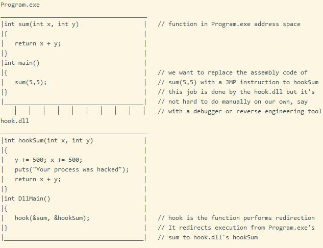

<h1 align="center">
	<a href="https://github.com/KeyC0de/Hooking-Detouring-Madness">Hooking Detouring Madness</a>
</h1>
<hr>


Here you will learn about this ancient miracle cure called Hooking. Our ancestors used hooking to catch fish! No just kidding, lets get to it..

Before we head straight to hooking, I provide an introduction to the Portable Executable (PE) and the various memory sections is in order.

The Portable Executable (PE) format is a file format for executables, object code, DLLs, FON Font files, and others used in 32-bit and 64-bit versions of Windows operating systems.
It is a data structure format that encapsulates the information necessary for the Windows OS loader to manage the wrapped executable code. This includes dynamic library references for linking, API export and import tables, resource management data and thread-local storage (TLS) data.

The Extensible Firmware Interface (EFI) specification states that PE is the standard executable format in EFI environments. On NT family of operating systems, the PE format is used for EXE, DLL, SYS (device driver), and other file types. There are 2 versions of PE's, the PE32 format which stands for Portable Executable 32-bit and PE32+ which is Portable Executable 64-bit format.

Initially, the only programs that existed were COM files. The format of a COM file is... um, none. There is no format. A COM file is just a memory image. This 'format' was inherited from CP/M. To load a COM file, the program loader merely sucked the file into memory unchanged and then jumped to the first byte. No fixups, no checksum, nothing. Just load and go. The COM file format had many problems, among which was that programs could not be bigger than about 64KB. To address these limitations, the EXE file format was introduced. The header of an EXE file begins with the magic letters 'MZ' and continues with other information that the program loader uses to load the program into memory and prepare it for execution.

**<u>Addresses</u>**</br>

- Physical Memory Address is what the CPU sees
- Virtual Address (VA) is an abstraction manageable by the OS
- Relative Virtual Address (RVA) (relative to the VA) is the offset from the VA at which the program is loaded.
	* The RVA in DLL/EXE (PE Format) files are usually relative to the 'loaded base address' in memory
	* The PE Format contains a 'section' mapping structure to map the physical file content into memory. So the RVA is not really relative to the file offset,
	* To calculate a RVA of some byte, you have to find its offset in the section and add the section base. Thus: AddressInMemory = BaseAddress + RVA
example: Assume you have a file (, a DLL) that's loaded at address 1000h. In that file, you have a variable at RVA 200h. In that case, the VA of that variable (after the DLL is mapped to memory) is 1200h (ie the 1000h base address of the DLL plus the 200h RVA (offset) to the variable.


**<u>Section Headers</u>**</br>

- .text , or .code : Code section, contains the program's instructions and constant data - read only -.
- .data : Generally used for writable data with some initialized non-zero content, variables, arrays. Thus, the data section contains information that could be changed during application execution and this section must be copied for every instance.
- .bss : (Block Started by Symbol) Used for writable (static) data initialized to zero or unitialized memory (including empty arrays)
- .reloc : Contains the relocation table. The relocation table is a list of pointers created by the compiler or assembler and stored in the object or executable file. Each entry in the table, is a pointer to an absolute address in the object code that must be changed when the loader relocates the program such that it will refer to the correct location. They are designed to support relocation of the program as a complete unit. In some cases, each entry in the table is itself relative to a base address of zero, so the entries themselves must be changed as the loader moves through the table.

In other words, the relocation table is a lookup table that holds pointers to all callable API's needed by the PE file that need patching, because they are dependent on the absolute address of the loaded program. This occurs when the file is loaded at a non-default base address.

Fun fact: a PE which doesn't have a .reloc section "wants" to be loaded at a specific address, regardless of the platform & environment in use (which can cause a plethora of issues). dlls typically have a reloc table, which contains pointers to its sections, if it has to be relocated in case its preferred base address is not available. But nowadays for security reasons (ASLR = Address Space Layout Randomization) where the loader will always try to load the dll at different locations.

You will find many variants of section names. The following are some of those I have stumbled upon:

- .rodata: read only data
- .rdata : Const/Read-only data of any kind are stored here. The loader will utilize these. This section must not have execute privileges.
- .rcdata : (resource data) Raw data whose format is not defined by windows. Thus, they can be any kind of data - ie user defined data, could be binary data injected into the program.
- .pdata : contains an array of function table entries for exception handling, and is pointed to by the exception table entry in the image data directory
- .edata : Export directory, descriptors & handles. Also known as the Exports section. When a PE exports code or data it is making them available for other PEs to use, particularly other `.exe`s. These are all referred as "symbols". The symbol information contains the symbol name, which is typically the same as the function or variable name, and an address. Also each exported symbol has an ordinal number associated that is used to look it up and differentiate it among all other symbols.
- .idata : Import directory for handles & descriptors. Also known as the Imports section. It is used by executable files (exe's, dll's etc) to designate the imported and exported functions
- *data : custom data sections
- .init : This section holds executable instructions that contribute to the process initialization code. That is, when a program starts to run the system arranges to execute the code in this section before the main program entry point (called main in C programs).
- .fini : This section holds executable instructions that contribute to the process termination code. That is, when a program exits normally, the system is arranged to execute the code in this section.
- .rsrc : Section which holds information about various other resources needed by the executable, such as the icon that is shown when looking at the executable file in explorer
- .ctors : Section which preserves a list of constructors
- .dtors : Section that holds a list of destructors
- .tls : Refers to 'Thread Local Storage' and is related to the TlsAlloc family of Win32 functions. When dealing with a .tls section, the memory manager sets up the page tables such that whenever a process switches threads, a new set of physical memory pages is mapped to the .tls section's address space.

**<u>Defines</u>**:</br>

```
#define IMAGE_FILE_RELOCS_STRIPPED           0x0001  // Relocation info stripped from file.
#define IMAGE_FILE_EXECUTABLE_IMAGE          0x0002  // File is executable  (ie no unresolved externel references).
#define IMAGE_FILE_LINE_NUMS_STRIPPED        0x0004  // Line nunbers stripped from file.
#define IMAGE_FILE_LOCAL_SYMS_STRIPPED       0x0008  // Local symbols stripped from file.
```

- Each section has to be located in a different page in memory and each has to be aligned. Each section/page requires alignment to a page boundary (4,096B). This differentiation is necessary, partly because sections require different privileges according to their types.
- Files though may use different alignment, from 512B (FAT sector size) or other (it's configurable).
- Pages have to be allocated contiguously, otherwise RVAs won't work correctly. This is done by the loader.


## Hooking

We have reached the meat of our tutorial. But you must agree with me that the previous stuff were important and you should know them if you're to become involved in these in-depth programming disciplines.

Hooking is an umbrella term in programming for a range of techniques used to alter the behaviour of a program. Hooking is a piece of code that intercepts function calls and handles them in a certain way.

Hooking can be used for debugging, extending functionality in applications. And of course hacking, ie. getting unauthorized access to programs and circumventing its intended course for example rootkits. But there are many legitimate uses, such as benchmarking programs, framerate timers in 3D games.

Hooks are also used used in plugins. At the base level plugins are basically dlls (libraries of code), which can be loaded by a program independently. The program can enumerate all its plugins at startup, or during runtime (if a new plugin is added). Plugins extend the functionality of the original program. You build your plugin separately, then load it at run-time, look up its symbols by name, and can then call them.

- On POSIX (Linux), you use the dlopen() family of functions.
- For Win32, there is LoadLibrary() which does something very similar, you build your code into a DLL.
But how are they injected into the base program? You guessed it: Hooking.

The simplest and easiest hook is a JMP instruction which is injected/inserted in place of a function call. Such code is called a "hook". And this is what we do here as well. In this case we want to find the address in Program.exe where we call `sum( 5, 5 );`. In order to find this address you can use either Visual Studio itself (just put a breakpoint and step through the code in Assembly) or through Cheat Engine or some other disassembler. As you can see in dllMain.cpp (which is thoroughly commented out) the `address` I was looking for is 0x012E63DC and I have hardcoded it in the program. You can change it easily in your own case. Remember addresses change whenever you change and recompile your `Program.exe`.

After we find this address we will replace it, along with the next 4 addresses with our hook code which is none other than (in Assembly):

```
jmp 0x012E63DC
```

The opcode of jmp requires 1 byte and an x86 address (like this one) requires 4 bytes, this is why we need 5 Bytes. hook_dll.dll uses the WinAPI function `VirtualProtect` to gain EXECUTABLE + MODIFY access to this 5-Byte memory region in Program.exe.

<p style="text-align: center;">
	
</p>

This is how we can directly store a value to a memory location in C and C++.

```
// C:
*(volatile unsigned long long int*)(0x010B1CE2) = 0xE824F7FFFF;
// equal to the following in C++:
volatile unsigned long long int* memLoc = reinterpret_cast<volatile unsigned long long*>( 0x010B1CE2 );
// 0x010B1CE2 + 5 = 0x010B1CE7, we need 5Bytes of code for the "JMP address" instruction
```

Similarly we can read from it. Keep that in mind for the dll program.

If you'll notice I have added various extraneous stuff in the code. This is just decor and you can omit it completely. When you have understood and performed the core of this tutorial you can look into that as well. It's nothing much really, I simply provide:

1. an alternative `hookSum` function written in Assembly
2. a way to return execution back to Program.exe if the user presses `F10` (after the dll has been hooked)

You can use any injector/dll-injector to hook the dll `Hook_dll.dll` into the executable `Program.exe`. I recommend the excellent free program ProcessHacker.

I have used Windows 8.1 x86_64, Visual Studio 2017, Modern C++17 to build the project.


# Contribute

Please submit any bugs you find through GitHub repository 'Issues' page with details describing how to replicate the problem. If you liked it or you learned something new give it a star, clone it, laugh at it, contribute to it whatever. I appreciate all of it. Enjoy.


# License

Distributed under the GNU GPL V3 License. See "GNU GPL license.txt" for more information.


# Contact

email: *nik.lazkey@gmail.com*</br>
website: *www.keyc0de.net*


# Acknowledgements

x86 Assembly instruction - opcode [reference](http://ref.x86asm.net/coder32.html)

[Inside Windows
An In-Depth Look into the Win32 Portable Executable File Format, Part 2](https://docs.microsoft.com/en-us/archive/msdn-magazine/2002/march/inside-windows-an-in-depth-look-into-the-win32-portable-executable-file-format-part-2)